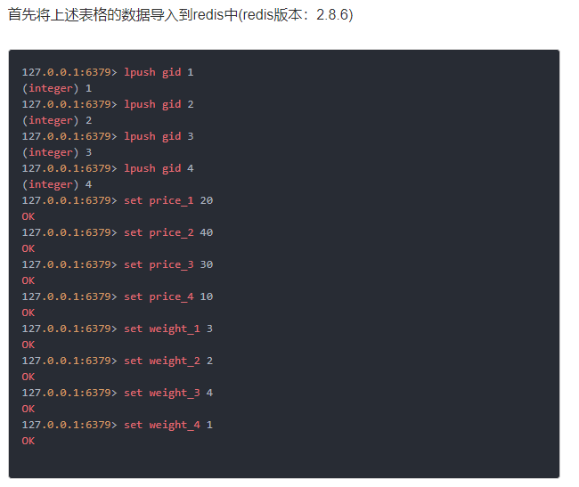
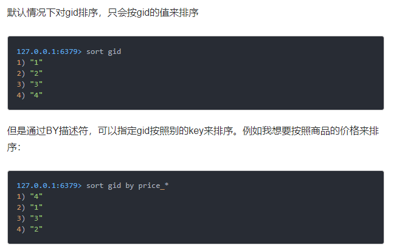

# Redis笔记
## 第一章	简介
### 1.2 特性
#### 1.2.1 存储结构

Redis支持的键值数据类型如下：
+ 字符串类型
+ 散列类型
+ 列表类型
+ 集合类型
+ 有序集合类型

## 第二章	准备
### 2.1 安装Redis
#### 2.1.1 在POSIX系统中安装

POSIX表示可移植操作系统接口，这里表示UNIX、Linux。安装命令如下：
``` commandline
wget http：//download.redis.io/redis-stable.tar.gz
tar –zxf redis-stable.tar.gz
cd redis-stable
make
```

编译完成后，最好执行make install命令来讲这些可执行程序复制到/usr/local/bin目录中以便以后执行程序时可以不用输入完整的路径，相当于添加到path吧，我猜的。

### 2.2 启动和停止Redis
``` commandline
$ redis-server –port 6379
$ redis-cli SHUTDOWN
```

一般生产上会将Redis配置为开机启动，可以参考书上原文。

### 2.2 2.5 多数据库
Redis默认支持16个数据库，数据库名从0开始，可以通过参数databases来修改，客户端与Redis建立连接后会自动选择0号数据库，可以使用SELECT命令更换数据库。

### 第三章	入门
#### 3.1 热身
Redis命令不区分大小写。
``` commandline
KEYS pattern：获得符合规则的键名列表，会遍历Redis中的所有键，键的数量多的时候会影响性能，不要在生产环境使用。
EXISTS key：判断一个键是否存在
DEL key[key…]：删除键
TYPE key：获得键值的数据类型
```

#### 3.2 字符串类型
最大容量是512M，但是未来应该会更大。
##### 3.2.2 命令
1.基本操作

``` commandline
APPEND key value：向尾部追加值
STRLEN key：获取字符串长度
MGET key [key …]：同时获得多个键值
MSET key value [key value …]:同时设置多个键值

INCR key：递增数字
DECR key：递减数字
INCRBY key increment
DECRBY key decrement
INCRBYFLOAT key increment
```

2.位操作(非常重要)
``` commandline
GETBIT key offset
SETBIT key offset value
BITCOUNT key [start] [end]
BITOP operation destkey key [key …]：对多个字符串类型键进行位运算，并将结果存储在destkey中，支持AND、OR、XOR（异或）、NOT。
BITPOS key value：可以获得指定键的第一个0或者1的位置（偏移量）。
```
位操作结合布隆过滤器可以高性能的解决很多0和1的问题。

#### 3.3 散列类型
##### 3.3.1 介绍
Redis不支持数据类型嵌套。一个散列类型键最多可以有2的32次方减1个字段。
##### 3.3.2 命令
``` commandline
HSET key field value
KGET
HMSET
HMGET
HGETALL：获取键中所有字段和字段值
HEXISTS key field：判断字段是否存在
HSETNX key field value：当字段不存在是赋值，多用于带有过期时间的锁的获取（if Not eXists），Redis中的命令都是原子操作
HINCRBY key field increment：增加数字
HDEL key field：删除字段，不是删除键，删除键还是用DEL
HKEYS key：只获取字段名
HVALS key：只获取字段值
HLEN key：获取字段数量
```

### 3.4 列表类型
#### 3.4.1 介绍
可以存储一个有序的字符串列表，是一个双向链表，所以向两头添加元素的时间复杂度为O(1)，获取两头的10条记录也是极快的，一般当做队列或栈使用，最多能容纳2的32次方减1个元素。
#### 3.4.2 命令
``` commandline
LPUSH 
RPUSH
LPOP
RPOP
LLEN key：获取元素个数
LRANGE key start stop：获取列表片段
LREM key count value：删除列表中前count个值为value的元素，当count>0时，从左边开始删除；当count>0时从右边开始删除；当count=0时，删除所有值为value的元素。
LINDEX key index：获得指定索引的元素值
LSET key index value
LTRIM key start end：删除指定索引范围之外的所有元素，也就是只保留指定索引范围内的元素，范围是一个左闭右闭区间。常常与LPUSH命令一起用于限制列表中元素的数量，比如记录日志时我们希望只保留最近的100条日志，则每次加入新元素时执行一次LTRIM logs 0 99即可。
LINSERT key BEFORE|AFTER pivot value：从左至右查找pivot的元素，然后将value元素插入到BEFORE|AFTER。
RPOPLPUSH source destination：将元素从source列表的右边弹出压入destination列表的左边。该命令可以很直观的在多个队列中传递数据。当source合destination相同的时候，该命令会不断的将队尾的元素移到队首，借助这个特性可以用于存放需要循环监控的网址，并且可以不断向队列添加新的网址，而且易扩展，可以多个客户端同时处理队列。厉害厉害！！！
```

### 3.5 集合类型
#### 3.5.1 介绍
集合中每个元素都是不同的，一个键最多可以存储2的32次方减1个字符串。使用值为空的散列表实现，所以查找的时间复杂度为O(1)。
#### 3.5.2 命令
``` commandline
SADD
SREM
SMEMBERS key：获得集合中所有元素
SISMEMBER key number：判断元素是否在集合中
SDIFF key [key…]：对多个集合执行差集运算，前面的减后面的。我认为原理是这样的，从前面的集合每次拿出一个元素，然后到后面的集合中判断是否存在，如果存在就丢弃，不存在就放到待返回的临时集合里面。
SINTER key [key…]：对多个集合执行交集运算
SUNION key [key…]：对多个集合执行并集运算
SDIFFSTORE destination key [key…] 进行集合运算并将结果存储到destination中，而不返回运算结果。
SINTERSTORE：同上。
SUNIONSTORE：同上。
SCARD：获得集合中元素个数
SRANDMEMBER key [count]：随机返回集合中的元素，count不是必传元素，如果没有就返回一个，如果count>0，就返回count个不重复的元素，如果count<0，就返回|count|个可能重复的元素。该命令的随机性并不公平，集合采用散列表的存储结构，由桶和碰撞产生的链表组成，随机取值会先随机选择一个桶，再随机选择该桶的链表上随机取一个值，桶的概率是相同的，但是桶中元素越少，那个桶中的值被选中的概率就会越高。
SPOP key：从集合中随机弹出一个元素，因为集合无序，所以是随机弹出。
```

### 3.6 有序集合类型

#### 3.6.1 介绍

每个元素都关联了一个分数，使用散列表和跳跃表实现，所以查找的时间复杂度为O(log(N))。

#### 3.6.2 命令
``` commandline
ZADD key score member [score member…]：score支持双精度浮点数，+-inf表示正负无穷大
ZSCORE key member：获得元素的分数
ZRANGE key start stop [WITHSCORES]：按照分数从小到大的顺序，返回从start到stop之间的所有元素（包含两端的元素）。索引从0开始，负数表示从后往前查找。WITHSCORES参数代表带上分数一起返回。时间复杂度为O(log n+m)（其中n为有序集合的基数，m为返回的元素个数）。如果分数相同会按照字典顺序排序，如果是中文，按编码的字典顺序排序。
ZREVRANGE key start stop [WITHSCORES]：按照分数从大到小的顺序排序，其他同上。
ZRANGEBYSCORE key [()min [()max [WITHSCORES] [LIMIT offset count]：按照元素分数从小到大的顺序返回分数在[min max]区间的元素，如果是开区间的话，可以在min、max前面根据具体需求添加(。如果需要返回分数则带上WITHSCORES参数，最后的LIMIT offset count则表示在前面条件已经获得的元素列表中，从offset开始（包括offset，索引从0开始），取前count个元素作为最终结果返回。一般用于顺序排序选择高于某值的元素，比如高于60分的人。
ZREVRANGESCORE：分数从大到小排序，并且max在min之前，其他同上。一般用于倒序排序取前几名，比如成绩的前几名。
ZINCRBY key increment member：在键为key的集合中为成员member增加increment分。如果increment是负数，则表示减分。
ZCARD：获得集合中元素的数量
ZCOUNT key min max：获得指定分数范围的元素个数

ZREM：删除元素
ZREMRANGEBYRANK key start stop：根据分数从小到大的顺序排序，并删除指定排名范围内的所有元素。从0开始排序，左闭右闭区间。
ZREMRANGEBYSCORE key min max：删除指定分数范围内的所有元素。

ZRANK key member：获得元素的排名，从小到大排序。
ZREVRANK key member：倒序获得元素的排名。

ZINTERSTORE destination numkeys key [key…] [WEIGHTS weight [weight …]] [AGGREGATE SUM|MIN|MAX]：用于计算numkeys个集合的交集，并将结果存储在destination中，destination集合中元素的分数默认是numkeys个集合中该元素的和，但是也可以通过AGGREGATE参数来指定，MIN表示取最小值，MAX表示取最大值。同时，还可以使用WEIGHTS来设置每个集合的权重，这样在计算分数的时候，会乘以该分数。
ZINTERSTORE：计算并集，用法同上。
```


## 第四章	进阶
### 4.1 事务
#### 4.1.1 概述
Redis中事务由MULTI命令开始，然后发送该事务中的命令，Redis会返回QUEUED表示已经将需要执行的命令存放在队列中了，最后发送EXEC命令开始按顺序执行一个事务队列中的所有命令，并且该过程是原子性的。
#### 4.1.2 错误处理
错误有如下两类错误：

1. 语法错误。如果压入队列时有语法错误，在执行EXEC的时候Redis会直接返回错误，不执行任何事务队列中的命令。
2. 运行错误。有些错误在命令执行之前是无法发现的，比如命令类型和数据类型不匹配，所以这种错误命令在Redis中是会执行的，只不过会报错，同样，其他正确的命令也会得到执行，然而Redis中并没有回滚功能，所以出现这种错误只有开发者自己收拾烂摊子，但是只要正确规划，这种错误是完全可以避免的。由于Redis不支持回滚，所以在事务上可以保持简洁和快速。

#### 4.1.3 WATCH命令介绍
监控一个值，如果该值在WATCH、MULTI之间发生改变，则不执行该MULTI、EXEC事务队列中的命令。如果该键是含有过期时间的，并且在监控期间（也就是WATCH、MULTI之间）过期了，则不会被WATCH命令认为该键被改变。该命令只阻止被监控的键值被修改后的第一个事务的执行。执行EXEC命令会取消对所有键的监控，UNWATCH也可以取消所有键的监控（未证实，但是根据语法判断）。

### 4.2 过期时间

``` commandline
EXPIRE key seconds：设置或者重设键的过期时间，单位秒，必须是整数，所以只能精确到1秒。
PEXPIRE：单位是毫秒，其他同上。
EXPIREAT：使用Unix时间作为第二个参数表示键的过期时间，单位为秒，其他同EXPIRE。
PEXPIREAT：单位为毫秒，其他同上。

TTL key：返回键的剩余时间，-1表示永久存在，-2表示键不存在
PTTL：单位是毫秒，其他同上。

PERSIST key：清除键的过期时间设置，如果键的值被修改了，也会自动清除键的过期时间。但是其他对键值进行操作的命令（INCR、LPUSH、HSET、ZREM）不会影响键的过期时间。
```
	
#### 4.2.3 实现访问频率限制

书上的案例是说用一个列表来存储每次访问的时间，如果列表的数量达到限制的数量就用这次的时间和第一次的时间做差，如果在限制的时间内就表示超过了访问频率，需要对其做限制，否则就将这次的时间放入列表中，并把最早的时间删除。

但是我的实现方法是每次访问都在redis集合中放入一个ip（用用户名应该更好）+序号的key，value为空值，序号是由限制次数（比如一分钟10次，限制次数就是10）决定，并且将数字存入redis的列表中，做为队列循环使用。然后给这个key设置一个过期时间，时间为指定的限制时间，比如一分钟之内访问十个页面，那这个过期时间就是一分钟。每次访问页面都判断一下这些key还存在的个数，如果超过指定的10个，就表示访问太频繁了，需要限制，否则，就从队列中取出一个序号，然后和ip一起组成key，存入redis集合中。

当然，光吹牛没用，代码在：https://github.com/cechaodeng/frequency_limit
### 4.3 排序
#### 4.3.2 SORT命令
SORT命令可以对集合、列表、有序集合类型进行排序。这里的排序只是对value进行排序，有序集合也是对value进行排序，而不是score。排序规则是将value转换成双精度浮点数来进行比较，如果无法转化，则会报错。

除了数字以外，可以使用ALPHA参数实现按照字典顺序排列非数字元素。

SORT也支持DESC和LIMIT参数，用法和SQL一样。

#### 4.3.3 BY参数

可以让SORT命令对外部某个键进行排序。



 
在这里，price_\*中的\*是一个占位符，先会把gid的值取出，代入到*中，再去查找price_*的值。例如在本例中，price_\*中的\*会分别被1,2,3,4代替，然后去取price_1,price_2,price_3,price_4的值来进行排序。

### 4.4 消息通知

#### 4.4.3 优先级队列

基于redis列表类型的队列。

BRPOP key[key …] timeout：从队列右边取元素，如果队列中没有元素，则阻塞，阻塞时间为timeout秒，如果超时，则返回nil，如果超时时间为0，表示不超时，如果队列中没有元素，则永远阻塞下去。

由于BRPOP命令可以同时接收多个键，且如果多个键都有元素，则按照从左到右的顺序取第一个键中的一个元素，利用这样的特性，我们可以实现优先队列，即，优先级越高的元素放在越前面的队列中。

#### 4.4.4 “发布/订阅”模式

```commandline
PUBLISH channel message
SUBSCRIBE channel
```

## 第七章 持久化

### 7.1 RDB方式

RDB方式的持久化是根据快照方式完成的，当出现以下几种情况的时候Redis会对数据进行快照：
+ 根据配置规则进行自动快照：配置文件中的配置，如：save 900 1表示15分钟（900秒）内有1个以上的键被更改则进行快照。这样的条件可以同时存在多条，并以或的方式组成快照的条件。
+ 用户执行SAVE或BGSAVE命令时：SAVE命令执行过程中会阻塞所有来自客户端的请求，不推荐使用。BGSAVE后台异步进行快照操作，同时还能相应客户端的请求，`但是在执行快照期间的请求是否会被快照呢？（不会，详见下文RDB原理）`可以通过LASTSAVE命令获取最近一次成功执行快照的时间。根据配置进行自动快照采用的即时BGSAVE的异步快照。
+ 执行FLUSHALL命令：执行该命令，Redis会清除数据库中所有数据，但是只要自动快照的条件不为空，Redis就会执行一次快照操作。当然，如果自动太快的条件为空，就不会进行快照。
+ 执行复制时：当设置了主从模式时，会在复制初始化阶段进行自动快照，即使没有定义自动快照条件。

#### 7.1.5 快照原理

快照文件默认存储在当前进程的工作目录中的dump.rdb文件中，可以通过配置dir和dbfilename两个参数分别制定路径和文件名。快照过程如下：
1. Redis通过fork函数复制一份当前进程（父进程）的副本（子进程）
2. 父进程继续处理客户端的请求，子进行开始将内存中的数据写入硬盘中的临时文件。如果在写入的过程中，有新的客户端请求对数据进行写操作，操作系统（为什么是操作系统）会将该数据复制一份以保证子进程的数据不受影响，所以快照存储的是执行fork函数那一刻的内存数据。这个策略被称之为“写时复制”，这种策略让看上去有两分的内存副本实际上占用的内存并没有两倍。但即使如此，在快照过程中如果有大量的写操作，也会有可能超过配置给Redis的内存，为此需要确保Linux系统允许应用程序申请超过可用内存（物理内存和交换分区）的空间，方法是在/etc/sysct1.conf文件中加入vm.overcommit_memory=1，然后重启系统或执行sysct1 vm.overcommit_memory=1确保设置生效。
3. 当子进程写入完所有数据后会用该临时文件替换旧的RDB文件，所以在任意时候RDB文件都是完整的。所以我们可以通过备份RDB文件来实现Redis数据库的备份。

### 7.2 AOF方式

默认情况下是没有开启AOF方式的持久化的，可以通过appendonly yes来启动。

由于是通过追加每一条写命令到硬盘中，所以对Redis的性能是有一定影响的，但是大部分情况下这个影响是可以接受的，之前受高人点拨，对于网络请求，硬盘的读写是远远超过网络传输的，所以这里不会成为性能瓶颈。另外，使用较快的硬盘也可以提高性能。

由于每次写操作都会写入AOF文件，对于同一个键来说，前面的写命令就没用了，长此以往，就出现大量的无用命令记录，所以Redis会在达到一定条件的时候，重写AOF文件，将没用的命令删除，该条件可以在配置文件中配置：

```commandline
auto-aof-rewrite-percentage 10：当目前的AOF文件的大小超过上一次重写前的AOF文件大小的百分之多少时会再次重写，如果之前没有重写过，则以启动时的AOF文件大小为依据。比如上次重写前是100M，配置是10，重写之后10M（该值没用，便于理解），那么这次重写会发生在当AOF文件为110M的时候重写。配置是10相当于百分之十，可以理解为，上次重写和这次重写中间可能发生的无法被重写删掉的命令的数量。
auto-aof-rewrite-min-size 64mb：允许重写的最小大小，如果AOF文件很小，即使有很多重复命令，我们也不care。
```

我们也可以使用BGREWRITEAOF命令来手动执行AOF重写。

#### 7.2.1 AOF重写原理

1. fork一条子进程，类似于RDB，将此刻的数据用命令写入文件中。
2. 主进程继续处理客户端的请求，并将所有的写命令写入AOF重写缓存中。
3. 子进行写完之后，主进程对客户端请求阻塞，将AOF缓存区中的命令写入新的AOF文件（`是否还会写入旧的AOF文件呢？我觉得应该会，万一子进程出现什么情况也不至于这些命令丢失，不过也可以从缓冲区中写入旧的AOF文件，但是这样是否逻辑就太复杂了，因为主线程也不知道子线程到底是否还活着`）。
（`如果一个有过期时间的key写入了AOF中，在重写AOF之前过期了，并且重写AOF之前redis挂了，那这个key是不是永远不会过期了`）
4. 用新的AOF文件原子覆盖旧的AOF文件。

#### 7.2.3 同步硬盘数据

虽然AOF会将每次执行的命令都写入硬盘，但是操作系统有缓存机制，数据并没有写入硬盘，而是进入了系统的硬盘缓存，默认是每30秒执行一次同步，将缓存写入硬盘，这样的话可能会导致30秒的数据丢失，所以Redis每次写入AOF文件时需要主动要求系统将缓存内容同步到硬盘中。我们可以通过如下配置：

```commandline
Appendfsync always:每次执行写入都通知操作系统写入,最安全，但是性能最差。
Appendfsync everysec:每一秒写入一次，Redis默认，折中方式，推荐方式。
Appendfsync no：不通知，采用操作系统默认，Linux下30秒，不安全，不推荐。
```

需要注意的是，当客户端的链接进入订阅模式时就不能再执行其他命令了。

## 第八章 集群

### 8.1 复制

#### 8.1.1 配置

	Redis-server –port 6380 –slaveof 127.0.0.1 6379
#### 8.1.2 原理

1. 从数据库向主数据库发送SYNC命令
2. 主数据库收到SYNC命令后，后台保存快照（可以使用repl-diskless-sync yes配置来使用无硬盘复制，直接发给从数据库，不在本地硬盘保持，提高性能），也就是RDB持久化（即使我们关闭了RDB持久化方式），并将持久化期间的命令缓存起来。
3. 将RDB文件和缓存起来的所有命令一起发送给从数据库，之后的所有命令都同步给从数据库（之后这一过程被称之为“复制同步阶段”，该过程贯穿同步过程的始终，知道主从关系终止为止）。
4. 从数据库将主数据库传过来的RDB文件写入到硬盘上的临时文件中，写完之后就用该临时文件来替换RDB文件，然后从RDB文件中加载数据，并执行缓存的命令。（`在这过程中收到主数据库发送过来的命令应该会存在命令队列里面，我认为`）。以上过程被称之为“复制初始化”。值得注意的是，这期间从数据库并不会阻塞，默认情况下会使用同步之前的数据（`难道同步之前的数据也有一份缓存？？？`）来对客户端进行响应。
可以配置slave-serve-stale-data参数为no来使从数据同步完成之前对所有命令回复错误：SYNC with master in progress。

#### 8.1.3 图结构

也就是多层主从结构，这种结构的好处是减少主数据库的同步压力，将压力分摊给每一级。

#### 8.1.7 增量复制

1. 从数据库重新连接主数据库之后，发送“”PSYNC 主数据库的运行ID 断开前最新的命令偏移量“给主数据”
2. 主数据库接收到PSYNC请求，先判断运行ID是不是自己。每个redis实例都有一个运行ID，并且每次重启都会重新生成一个。
3. 然后判断命令偏移量是否还在积压队列（每次同步给从数据库的命令都会放在积压队列中）中，存在的话才能进行增量复制，如果不存在，就只能全量复制。
