# 快速排序的理解

快速排序被称为20世纪最伟大的发明之一。

通过分而治之的思想进行排序，对每一次排序，称之为一个Partition。

## 单路排序

### 原理

每一次Partition，都会有一个值找到属于自己最终的位置，之后不需要被移动，我们称这个值为标定元素。

第一步，定义一下初始条件，
我们拿最左边的v作为此次Partition找到最终位置的元素，用指针L指向；
橘黄色区域为小于v的元素，该区域右边界为指针j指向的元素；
紫色区域为大于V的元素；
e元素为当前与v比较的元素，用i指向，并且i指针逐步向右移动扫描。
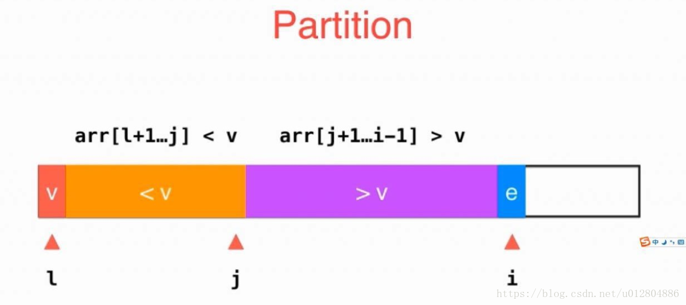

第二步，
如果i指针指向的e元素大于L指针指向的v元素，则i指针向右移动即可；
如果小于，则将j+1位置的元素与i位置的元素交换，然后j++。
这样，即可保证各初始条件不会被破坏。
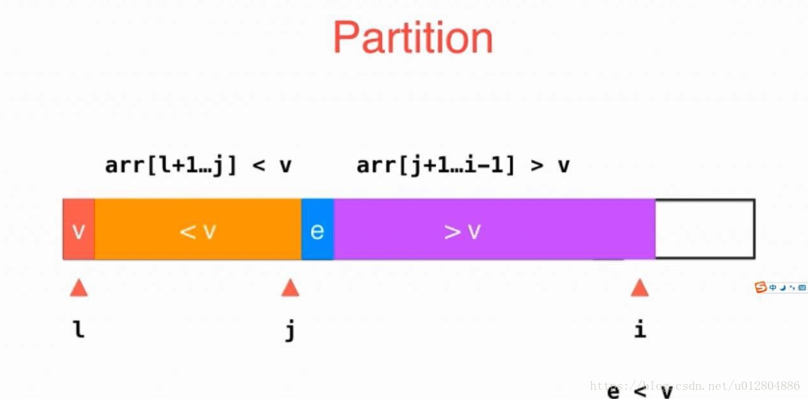

通过第二步，我们可以得到一个下图中的结果：
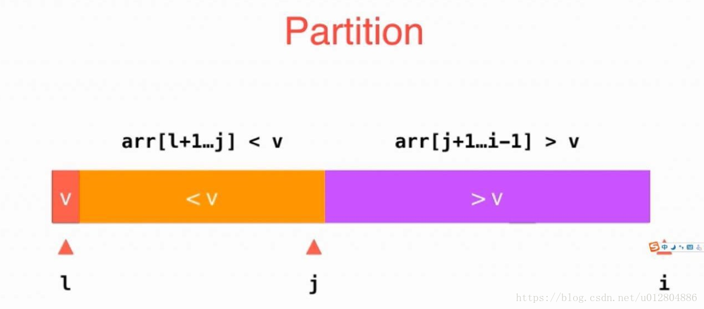

这时候，所有元素都比较完毕，总共分为图中三个区域。

最后一步，我们只需要将L位置的元素与j位置的元素调换位置，就能确定L位置的元素在这次Partition之后得到的最终位置；
接下来，再将v的左右两边分而治之，采用递归的方式继续Partition下去，就能得到最终的顺序结果。时间复杂度为O(nlgn)。

### 问题
最基本的快速排序就到此为止了，但是问题来了，都说快速排序对已经有序的数组排序是效率最差的时候，为什么呢？

在回答上面问题之前，我们先来分析一下这个问题。

快速排序的分而治之是怎么分的？
是通过一个标定元素划分为大于和小于两个区间，那么就有存在左右两边元素数量不均衡的情况，如下图所示：
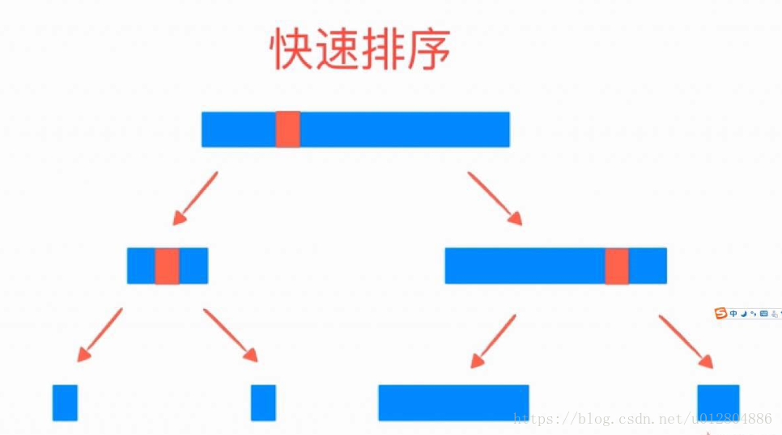
想象一下，在极端情况，也就是数组已经有序的情况下，上图应该会如何显示。

每一次标定元素都是最小的，分而治之的时候没有比标定元素小的区域，
所以只能分为一个区域，就是大于标定元素的所有元素组成的区域。
在这种极端情况下，快速排序的时间复杂度就降低到了O(n²)了。如图：
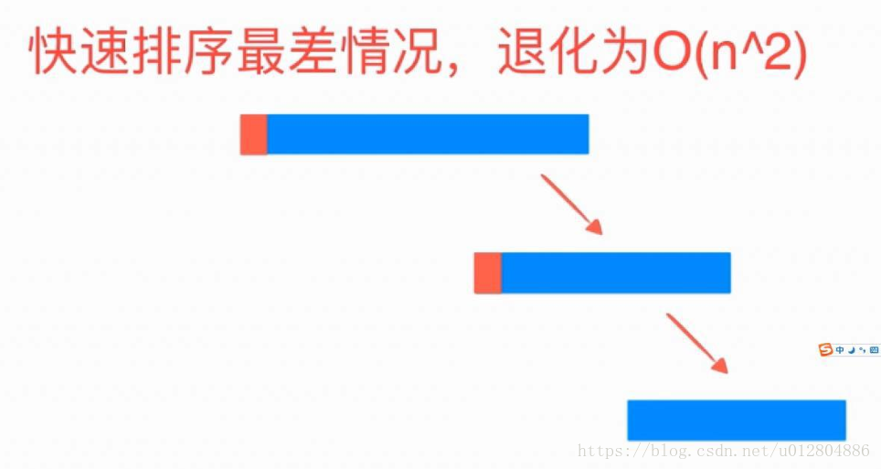
那么如何来解决这个问题呢，有一个很简单的方法。

我们现在每次取标定值都默认取最左边的第一个元素，
在有序的情况下，此元素一定是最小的（默认从小到大），所以我们可以通过随机取标定元素的方式来避免这个问题。
即：在每次选择标定元素的时候，随机一个位置，然后将那个位置的元素与最左边的第一个元素交换，让这个随机数来作为标定元素，这样就能在数学上期望每次分治就不会太极端。

那么问题来了，如果所有的元素都一样，怎么办？即使随机还是会出现这种极端情况。好，这个问题先放这里，我们先来考虑另一个接近的问题。

回忆一下，我们前面在将元素分区域的时候，是将小于标定元素的元素放在左边橙色区域，否则就直接向后扫描。也就是说，等于标定元素的也在大于标定元素的区域里面，如图所示：
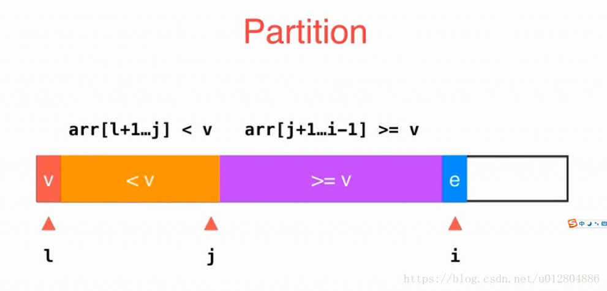
当然，如果我们把等于标定元素的元素放在小于标定元素的区域里面的话，就会像这样：
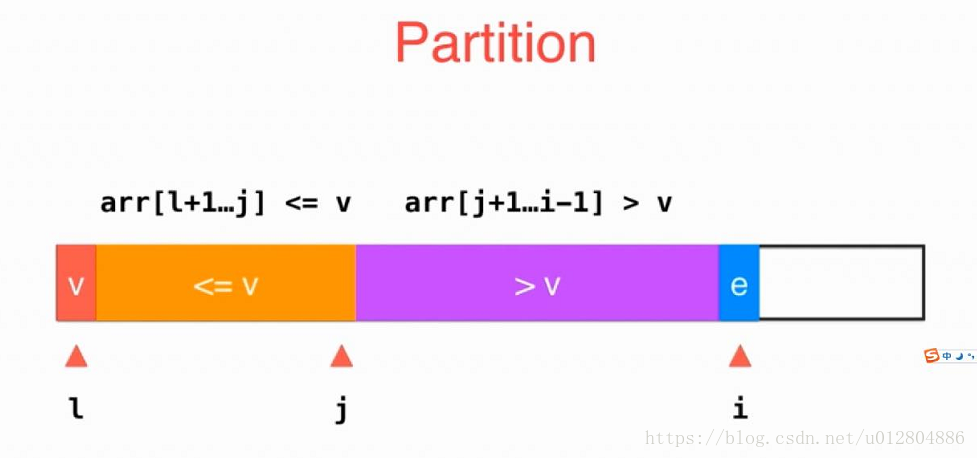
同样问题来了，如果等于标定元素的元素非常多，会怎么样呢？如图：
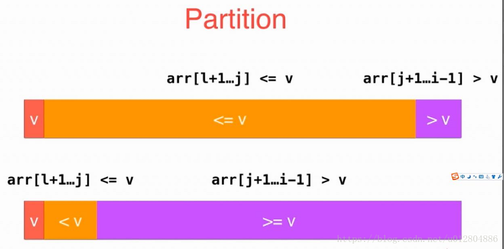
大家都能很轻易的发现，我们又回到了快速排序的最差情况，分治极端不均衡，此时的复杂度又接近O(n²)了。

玩来玩去，还是没有解决最终的问题，但是我们是有梦想的闲鱼，我们继续想办法。

##二路快速排序

### 原理
这一次，我们这样分区域。
指针L指向标定元素，指针i指向小于v区域外的右边第一个元素，准备从这里开始向右扫描，
同时指针j指向大于v区域外的左边第一个元素，准备从这里开始向左扫描，
指针r指向大于v区域内的最后一个元素。
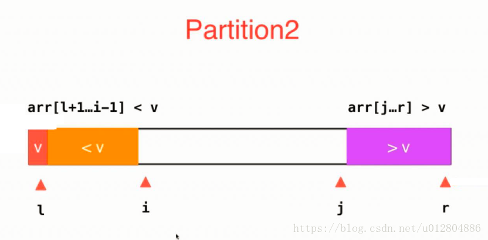

接下来，我们指针i开始向右扫描，如果小于标定元素v，直接向右移动一位。
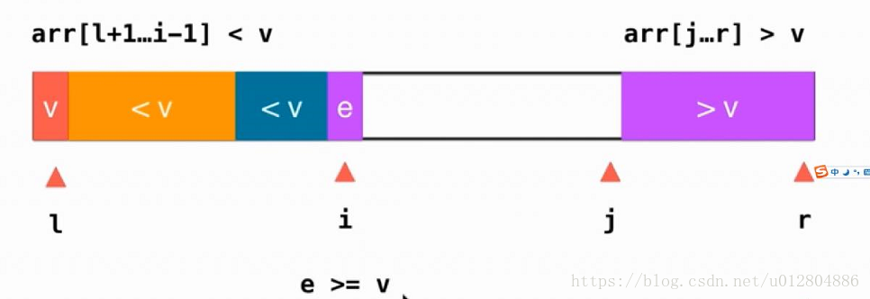
同理，指针j开始向左扫描，如果大于标定元素v，直接向左移动一位。
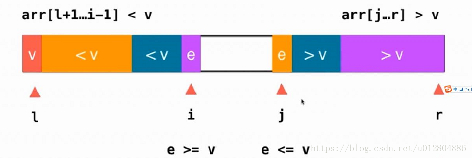
此时，指针i停留在一个大于等于标定元素的位置，
而指针j停留在一个小于等于标定元素的位置，如图所示：
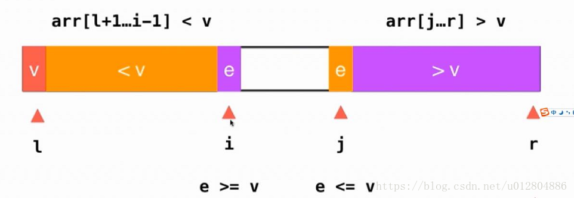
我们只需要将i位置的元素与j位置的元素交换位置，就能保证我们的基本性质不变，即各区域符合各自限定条件。如图：
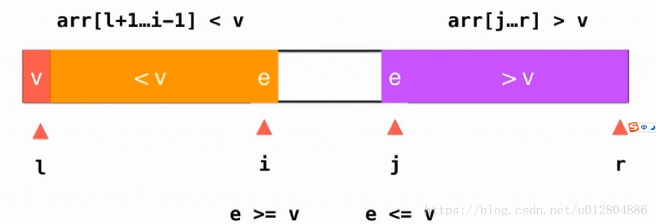
之后，指针i,j分别右移和左移一位，此时的数组如下：
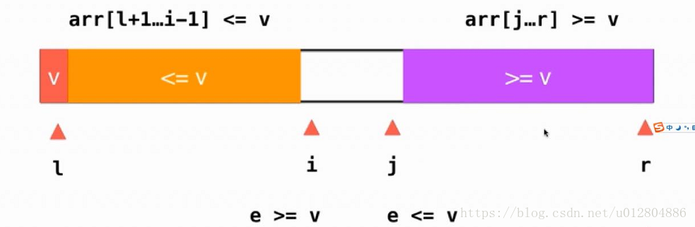
直到i==j，就完成了一次Partition。

通过这种方式将等于标定元素的元素数学期望上平均分到了两边，
注意，这里说的是数学期望，不是一定平均分到了两端。
这样就能解决了有大量相同元素导致出现极端的分治现象，从而影响了排序的效率的问题。

虽然，这种解决方案在理论上还是会存在极端的情况，
比如所有的相同元素都因为某种巧合分到了一端，导致分治严重倾斜，但是这种概率微乎其微。

### 问题
接下来，我们继续思考，前面的遗留问题。

如果所有的元素都一样，怎么办，上面的方法能解决吗？

可以解决。但是每个元素都相等的话，那么应该一次Partition全部确定位置，而不是每一次只确定一个元素。

既然我们是有梦想的闲鱼，那么我们就一定要有更高的追求。

## 多路快速排序

这一次，我们这样分区。

如图所示，L指向标定元素，
Lt指向小于标定元素的区域内的最右边的元素，
i指向等于标定元素的区域外的第一个元素，
gt指向大于标定元素区域内的最左边的元素，
r指向大于标定元素区域内的最右边元素。
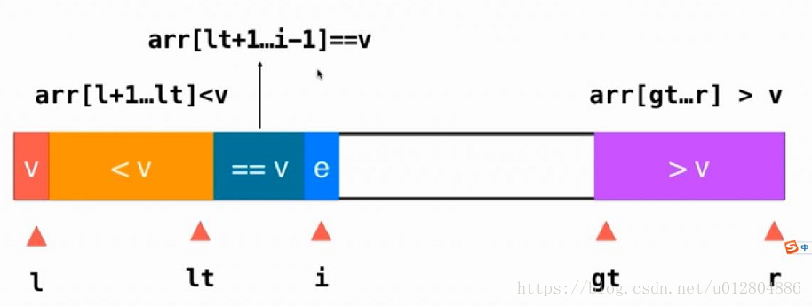
此时，i指针向右逐步扫描。
当指针i指向的元素e==v（指针L指向的标定元素），那么不需要进行任何操作，指针i向右移动一位，继续扫描。
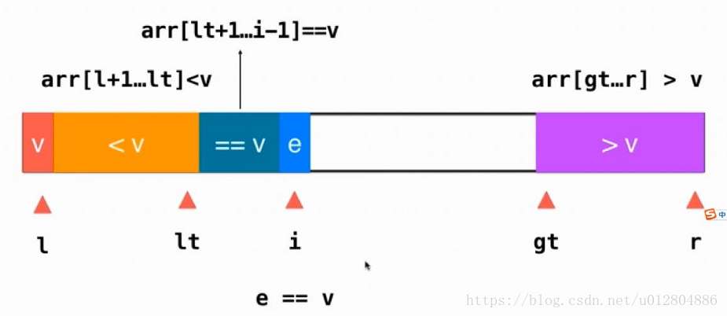
当指针i指向的元素e<v（指针L指向的标定元素），则将指针i位置的元素与指针Lt+1位置的元素进行交换，然后lt++，i++。
以保证各指针符合约定条件。
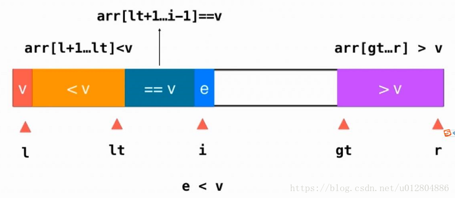
到这里，聪明的咸鱼肯定已经知道了，
当指针i指向的元素e>v（指针L指向的标定元素），只需要将指针i位置的元素与指针gt-1位置的元素进行交换，然后gt--即可，i不变，继续从原位置扫描，只不过i位置的元素变成了一个在这次Partition中没有进行过比较的新元素。

最终，整个数组的状态如图所示：
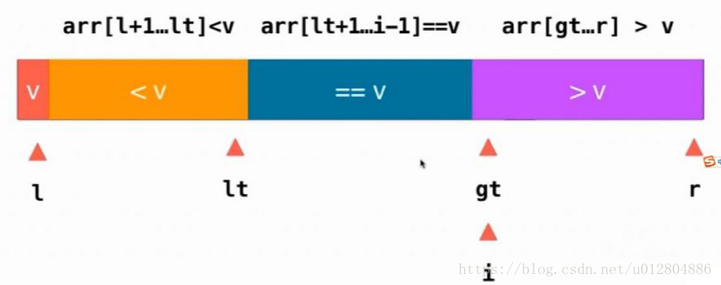
我们将L位置的元素与Lt位置的元素进行交换，就得到了一次完整的Partition的最终结果，
不同的是，这次Partition不仅仅是确定了一个元素的最终位置，而是和这个元素的值想同的所有元素的位置。
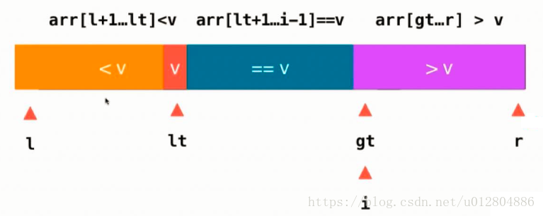
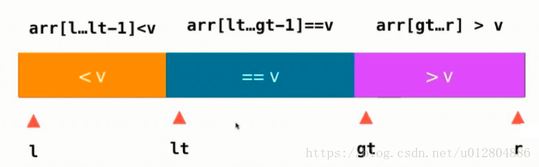
到这里，一次Partition就已经结束了。只需要将左右两边的区域进行分治就可以得到已经用最快的排序算法得到的有序数组。

